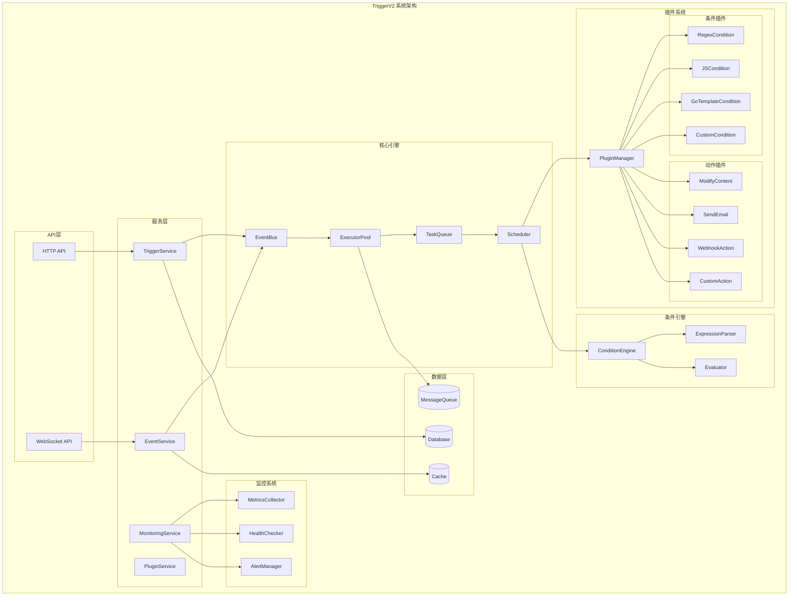
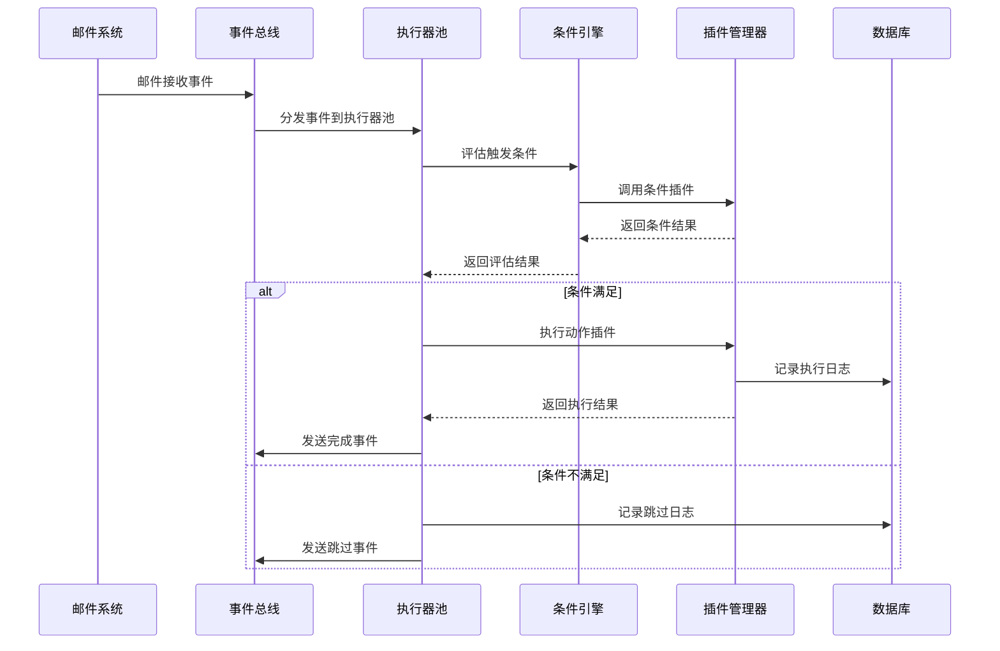
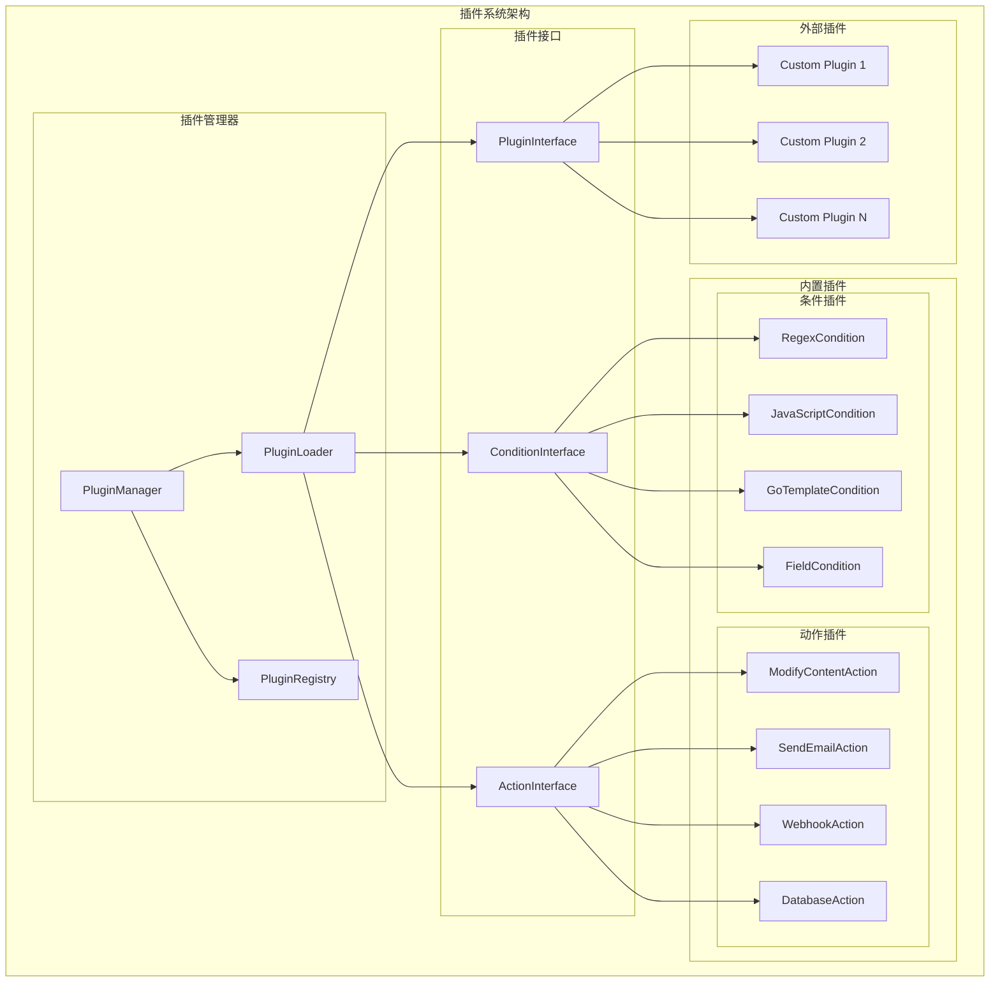

# TriggerV2 实施计划

## 整体架构设计

### 系统架构图



### 事件驱动流程图



### 插件架构图



## 实施步骤

### 第一阶段：核心架构实现

#### 1.1 事件系统
- **事件总线实现**
  - 创建 `EventBus` 接口和实现
  - 支持事件订阅和发布
  - 实现事件路由和过滤
  - 添加事件持久化机制

- **事件模型定义**
  - 定义各种事件类型
  - 实现事件序列化/反序列化
  - 添加事件版本控制

#### 1.2 执行器池
- **工作器池实现**
  - 创建 `ExecutorPool` 结构
  - 实现动态工作器管理
  - 添加工作器监控和统计

- **任务队列系统**
  - 实现优先级队列
  - 支持任务重试机制
  - 添加任务超时处理

#### 1.3 数据模型
- **TriggerV2 数据模型**
  - 定义新的触发器结构
  - 实现数据库迁移脚本
  - 添加索引优化

### 第二阶段：插件系统实现

#### 2.1 插件框架
- **插件接口定义**
  - 创建 `PluginInterface` 基础接口
  - 定义 `ConditionPlugin` 接口
  - 定义 `ActionPlugin` 接口

- **插件管理器**
  - 实现插件动态加载
  - 添加插件版本管理
  - 实现插件依赖解析

#### 2.2 内置插件实现
- **条件插件**
  - 正则表达式条件插件
  - JavaScript条件插件
  - Go模板条件插件
  - 字段比较条件插件

- **动作插件**
  - 内容修改动作插件
  - 邮件发送动作插件
  - Webhook动作插件
  - 数据库操作动作插件

### 第三阶段：高级功能实现

#### 3.1 复杂条件逻辑
- **条件引擎**
  - 实现逻辑表达式解析器
  - 支持 AND/OR/NOT 操作
  - 添加条件缓存机制

- **表达式系统**
  - 实现条件DSL语言
  - 支持嵌套条件组合
  - 添加条件验证器

#### 3.2 批处理优化
- **批量处理器**
  - 实现邮件批量查询
  - 添加批量条件评估
  - 支持批量动作执行

- **缓存系统**
  - 实现条件结果缓存
  - 添加邮件数据缓存
  - 支持缓存过期机制

#### 3.3 监控系统
- **指标收集**
  - 实现性能指标收集
  - 添加业务指标统计
  - 支持指标导出

- **健康检查**
  - 实现系统健康检查
  - 添加组件状态监控
  - 支持自动恢复机制

### 第四阶段：测试和文档

#### 4.1 单元测试
- **核心组件测试**
  - 事件总线测试
  - 执行器池测试
  - 插件系统测试
  - 条件引擎测试

- **插件测试**
  - 内置插件测试
  - 插件接口测试
  - 插件管理器测试

#### 4.2 集成测试
- **端到端测试**
  - 完整触发器流程测试
  - 多插件协作测试
  - 异常情况处理测试

- **性能测试**
  - 负载测试
  - 压力测试
  - 内存泄漏测试

#### 4.3 文档完善
- **API文档**
  - RESTful API文档
  - 插件开发文档
  - 配置参考文档

- **用户文档**
  - 快速入门指南
  - 最佳实践指南
  - 故障排除指南

## 文件创建清单

### 核心架构文件
```
backend/internal/triggerv2/
├── core/
│   ├── event_bus.go
│   ├── event_bus_test.go
│   ├── executor_pool.go
│   ├── executor_pool_test.go
│   ├── task_queue.go
│   ├── task_queue_test.go
│   ├── scheduler.go
│   └── scheduler_test.go
```

### 插件系统文件
```
├── plugins/
│   ├── interfaces.go
│   ├── manager.go
│   ├── manager_test.go
│   ├── condition/
│   │   ├── regex.go
│   │   ├── javascript.go
│   │   ├── gotemplate.go
│   │   └── field.go
│   └── action/
│       ├── modify_content.go
│       ├── send_email.go
│       ├── webhook.go
│       └── database.go
```

### 条件引擎文件
```
├── conditions/
│   ├── engine.go
│   ├── engine_test.go
│   ├── expression.go
│   ├── expression_test.go
│   ├── evaluator.go
│   └── evaluator_test.go
```

### 监控系统文件
```
├── monitoring/
│   ├── metrics.go
│   ├── metrics_test.go
│   ├── health.go
│   ├── health_test.go
│   ├── alerts.go
│   └── alerts_test.go
```

### 数据层文件
```
├── models/
│   ├── trigger.go
│   ├── event.go
│   ├── config.go
│   └── plugin.go
├── repository/
│   ├── trigger.go
│   ├── trigger_test.go
│   ├── event.go
│   ├── event_test.go
│   ├── log.go
│   └── log_test.go
```

### 服务层文件
```
├── service/
│   ├── trigger_service.go
│   ├── trigger_service_test.go
│   ├── event_service.go
│   ├── event_service_test.go
│   ├── plugin_service.go
│   └── plugin_service_test.go
```

### API层文件
```
└── api/
    ├── handlers.go
    ├── handlers_test.go
    ├── routes.go
    ├── middleware.go
    └── types.go
```

## 测试驱动开发策略

### 1. 单元测试优先
- 每个组件先写测试用例
- 确保测试覆盖率达到90%以上
- 使用表驱动测试模式

### 2. 模拟和依赖注入
- 使用接口进行依赖注入
- 创建模拟实现用于测试
- 确保组件可独立测试

### 3. 集成测试
- 使用测试数据库
- 模拟真实场景
- 验证组件间协作

### 4. 性能测试
- 基准测试
- 并发测试
- 内存使用测试

## 质量保证

### 代码质量
- 使用 `golangci-lint` 进行代码检查
- 遵循 Go 语言最佳实践
- 保持代码简洁和可读性

### 文档质量
- 为每个公共接口编写文档
- 提供使用示例
- 保持文档与代码同步

### 测试质量
- 确保测试的可重复性
- 覆盖边界条件
- 测试异常情况处理

---

**创建时间**: 2025-07-12T17:40:06.874Z
**版本**: 1.0.0
**状态**: 计划中